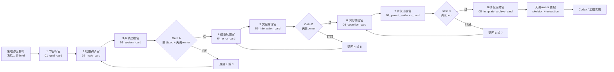
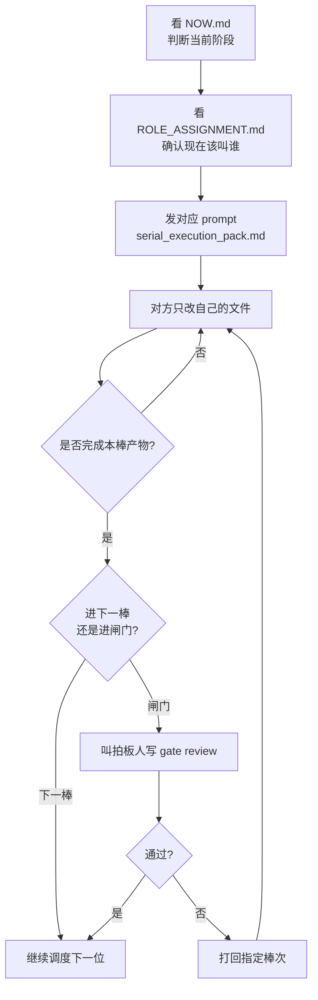

# lesson_01 / 人类调度看板

这页只服务一个目的：
让你一眼看清“现在该叫谁，产物落哪，下一步去哪”。

## 1. 调度主图

## 2. 你只要记住的调度口令

## 3. 人类调度员速查表

| 你看到的状态 | 你该叫的人 | 他只该改的地方 | 你拿到什么才算结束 |
|---|---|---|---|
| 上游未冻住 | 米哈游世界师 | [lesson_01_brief.md](/Users/lijiabo/MindForge/docs/40_lessons/lesson_01/lesson_01_brief.md) | brief 冻结 |
| 轮到第 1 棒 | 节目标官 | [01_goal_card.md](/Users/lijiabo/MindForge/docs/40_lessons/lesson_01/cards/01_goal_card.md) | 目标卡 |
| 轮到第 2 棒 | 戏剧钩子官 | [02_hook_card.md](/Users/lijiabo/MindForge/docs/40_lessons/lesson_01/cards/02_hook_card.md) | 钩子卡 |
| 轮到第 3 棒 | 系统建模官 | [03_system_card.md](/Users/lijiabo/MindForge/docs/40_lessons/lesson_01/cards/03_system_card.md) | 系统卡 |
| 轮到 Gate A | 腾讯ceo + 天美owner | [gate_a_review](/Users/lijiabo/MindForge/docs/40_lessons/lesson_01/records/gate_reviews/2026-03-25__lesson_01__gate_a__review.md) | Gate A 结论 |
| 轮到第 4 棒 | 错误反馈官 | [04_error_card.md](/Users/lijiabo/MindForge/docs/40_lessons/lesson_01/cards/04_error_card.md) | 错误卡 |
| 轮到第 5 棒 | 交互路径官 | [05_interaction_card.md](/Users/lijiabo/MindForge/docs/40_lessons/lesson_01/cards/05_interaction_card.md) | 交互卡 |
| 轮到 Gate B | 天美owner | [gate_b_review](/Users/lijiabo/MindForge/docs/40_lessons/lesson_01/records/gate_reviews/2026-03-25__lesson_01__gate_b__review.md) | Gate B 结论 |
| 轮到第 6 棒 | 认知校验官 | [06_cognition_card.md](/Users/lijiabo/MindForge/docs/40_lessons/lesson_01/cards/06_cognition_card.md) | 认知卡 |
| 轮到第 7 棒 | 家长证据官 | [07_parent_evidence_card.md](/Users/lijiabo/MindForge/docs/40_lessons/lesson_01/cards/07_parent_evidence_card.md) | 家长证据卡 |
| 轮到 Gate C | 腾讯ceo | [gate_c_review](/Users/lijiabo/MindForge/docs/40_lessons/lesson_01/records/gate_reviews/2026-03-25__lesson_01__gate_c__review.md) | Gate C 结论 |
| 轮到第 8 棒 | 模板沉淀官 | [08_template_archive_card.md](/Users/lijiabo/MindForge/docs/40_lessons/lesson_01/cards/08_template_archive_card.md) | 模板卡 |
| 准备交工程 | 天美owner | [lesson_01_minimum_unified_skeleton.md](/Users/lijiabo/MindForge/docs/40_lessons/lesson_01/lesson_01_minimum_unified_skeleton.md), [execution](/Users/lijiabo/MindForge/docs/40_lessons/lesson_01/execution) | 冻结执行包 |

## 4. 一条底线

如果有人想直接改上一棒正文，你就不放行。
