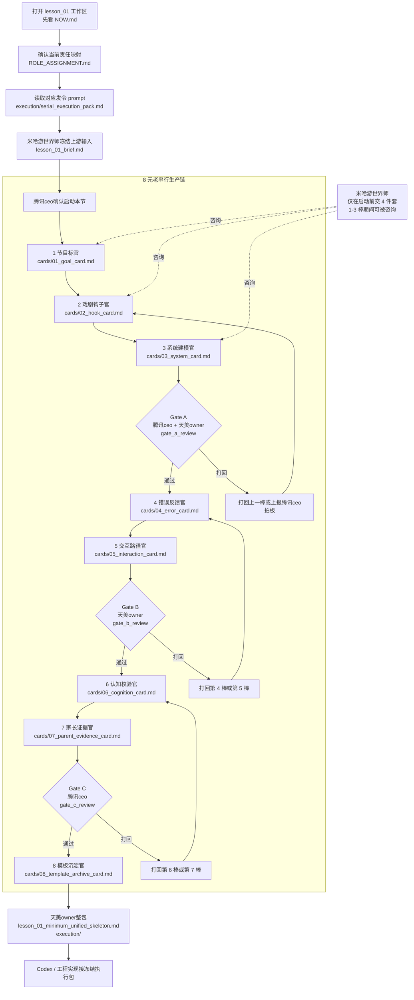

# lesson_01 / 导入与调度图

这份文件只回答两个问题：

1. `lesson_01` 应该怎么被导入到正式生产链
2. 你作为协调官，每一阶段到底该调度谁、看哪份文件、等什么产物

## 1. 总图

## 2. 你怎么导入这一节

只做 6 步，不要多。

1. 打开 [NOW.md](/Users/lijiabo/MindForge/docs/40_lessons/lesson_01/NOW.md)，确认这节是不是还在 `active_design_and_spec`。
2. 打开 [ROLE_ASSIGNMENT.md](/Users/lijiabo/MindForge/docs/40_lessons/lesson_01/ROLE_ASSIGNMENT.md)，确认当前称谓和文件责任位。
3. 让米哈游世界师冻结 [lesson_01_brief.md](/Users/lijiabo/MindForge/docs/40_lessons/lesson_01/lesson_01_brief.md)。
4. 在 [execution/serial_execution_pack.md](/Users/lijiabo/MindForge/docs/40_lessons/lesson_01/execution/serial_execution_pack.md) 里取对应棒次或闸门的发令 prompt。
5. 只调度当前这一棒，不同时把多棒一起放出去。
6. 每一棒落盘后，再决定是继续、打回，还是进闸门。

## 3. 你怎么调度

把自己理解成“放行器”，不是共同创作者。

| 当前阶段 | 你调度谁 | 对方只改哪份文件 | 你等什么产物 | 通过后去哪里 |
|---|---|---|---|---|
| 启动 | 米哈游世界师 | [lesson_01_brief.md](/Users/lijiabo/MindForge/docs/40_lessons/lesson_01/lesson_01_brief.md) | 上游 4 件套冻结版 | 第 1 棒 |
| 第 1 棒 | 节目标官 | [01_goal_card.md](/Users/lijiabo/MindForge/docs/40_lessons/lesson_01/cards/01_goal_card.md) | 目标卡 + 交棒块 | 第 2 棒 |
| 第 2 棒 | 戏剧钩子官 | [02_hook_card.md](/Users/lijiabo/MindForge/docs/40_lessons/lesson_01/cards/02_hook_card.md) | 钩子卡 + 交棒块 | 第 3 棒 |
| 第 3 棒 | 系统建模官 | [03_system_card.md](/Users/lijiabo/MindForge/docs/40_lessons/lesson_01/cards/03_system_card.md) | 系统卡 + 交棒块 | Gate A |
| Gate A | 腾讯ceo + 天美owner | [gate_a_review](/Users/lijiabo/MindForge/docs/40_lessons/lesson_01/records/gate_reviews/2026-03-25__lesson_01__gate_a__review.md) | 审查结论 | 第 4 棒或打回 |
| 第 4 棒 | 错误反馈官 | [04_error_card.md](/Users/lijiabo/MindForge/docs/40_lessons/lesson_01/cards/04_error_card.md) | 错误卡 + 交棒块 | 第 5 棒 |
| 第 5 棒 | 交互路径官 | [05_interaction_card.md](/Users/lijiabo/MindForge/docs/40_lessons/lesson_01/cards/05_interaction_card.md) | 交互卡 + 交棒块 | Gate B |
| Gate B | 天美owner | [gate_b_review](/Users/lijiabo/MindForge/docs/40_lessons/lesson_01/records/gate_reviews/2026-03-25__lesson_01__gate_b__review.md) | 可实现性结论 | 第 6 棒或打回 |
| 第 6 棒 | 认知校验官 | [06_cognition_card.md](/Users/lijiabo/MindForge/docs/40_lessons/lesson_01/cards/06_cognition_card.md) | 认知卡 + 交棒块 | 第 7 棒 |
| 第 7 棒 | 家长证据官 | [07_parent_evidence_card.md](/Users/lijiabo/MindForge/docs/40_lessons/lesson_01/cards/07_parent_evidence_card.md) | 家长证据卡 + 交棒块 | Gate C |
| Gate C | 腾讯ceo | [gate_c_review](/Users/lijiabo/MindForge/docs/40_lessons/lesson_01/records/gate_reviews/2026-03-25__lesson_01__gate_c__review.md) | 价值结论 | 第 8 棒或打回 |
| 第 8 棒 | 模板沉淀官 | [08_template_archive_card.md](/Users/lijiabo/MindForge/docs/40_lessons/lesson_01/cards/08_template_archive_card.md) | 模板沉淀卡 | 技术整包 |
| 技术整包 | 天美owner | [lesson_01_minimum_unified_skeleton.md](/Users/lijiabo/MindForge/docs/40_lessons/lesson_01/lesson_01_minimum_unified_skeleton.md), [execution](/Users/lijiabo/MindForge/docs/40_lessons/lesson_01/execution) | 冻结执行包 | Codex |

## 4. 你每一步只检查什么

不要每一步都全盘检查，只检查当前阶段的放行条件。

| 阶段 | 你只检查这一个问题 |
|---|---|
| 启动 | 上游输入是不是已经冻结 |
| 第 1 棒 | 这节目标是不是明确到可以验证 |
| 第 2 棒 | 钩子是不是抓人但没压垮系统 |
| 第 3 棒 | 系统是不是可运行对象 |
| Gate A | 目标、钩子、系统能不能成立 |
| 第 4 棒 | 错误是不是可观测，而不是替孩子答题 |
| 第 5 棒 | 交互是不是支持思考发生，而不是流程跑完 |
| Gate B | 技术上能不能支持对话、修改、运行、重跑 |
| 第 6 棒 | 这一节到底在练什么思维 |
| 第 7 棒 | 家长价值是不是一句话讲得清 |
| Gate C | 这节值不值得进入模板化和实现 |
| 第 8 棒 | 沉淀的是模板，不是再创作一版 |
| 技术整包 | 给 Codex 的包是不是已经冻结且完整 |

## 5. 你不该做什么

- 不要同时调度两个正文棒次并行开写。
- 不要允许下一棒直接改上一棒正文。
- 不要把闸门意见只放在聊天里，不落 [records](/Users/lijiabo/MindForge/docs/40_lessons/lesson_01/records)。
- 不要让天美owner在第 1 棒前就深度改产品内容。
- 不要让米哈游世界师一路接管 8 棒正文。

## 6. 你每天真正要打开的文件

如果你只想知道“现在轮到谁”，只看这 4 个入口：

1. [NOW.md](/Users/lijiabo/MindForge/docs/40_lessons/lesson_01/NOW.md)
2. [ROLE_ASSIGNMENT.md](/Users/lijiabo/MindForge/docs/40_lessons/lesson_01/ROLE_ASSIGNMENT.md)
3. [ORCHESTRATION_MAP.md](/Users/lijiabo/MindForge/docs/40_lessons/lesson_01/ORCHESTRATION_MAP.md)
4. [serial_execution_pack.md](/Users/lijiabo/MindForge/docs/40_lessons/lesson_01/execution/serial_execution_pack.md)
