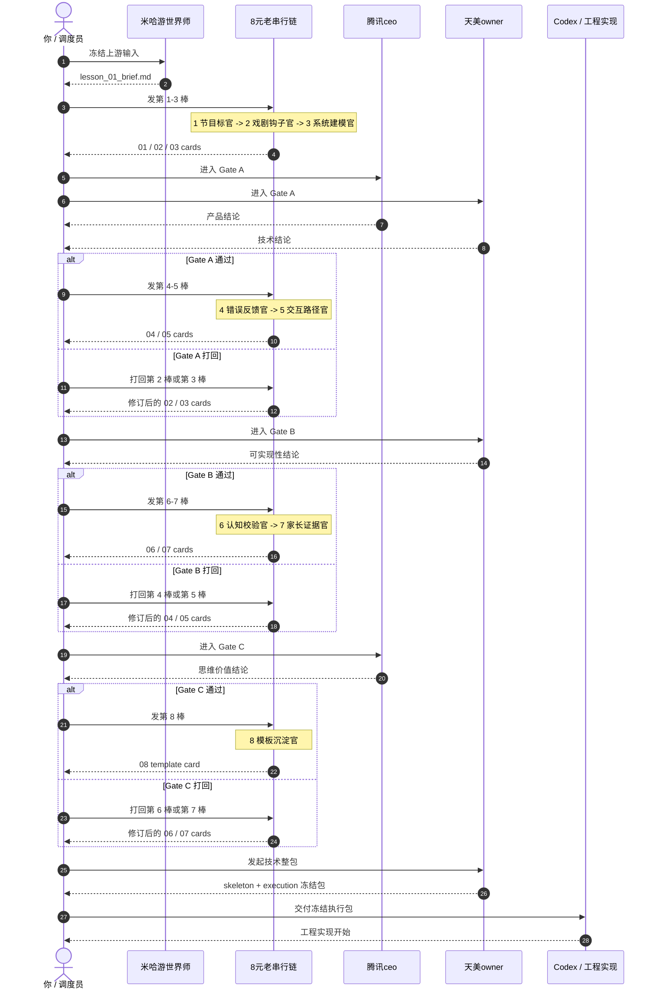
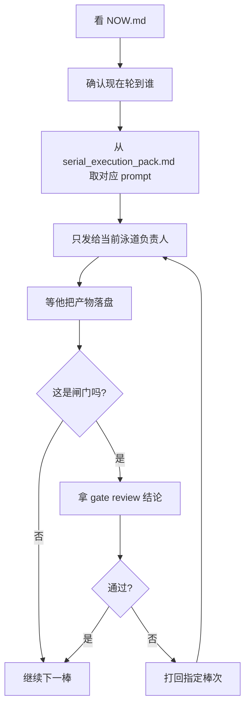

# lesson_01 / 泳道调度图

这页只回答一件事：
从调度员视角看，`lesson_01` 这条链到底怎么发令、收件、放行、打回。

## 1. 泳道时序图

## 2. 调度员只需要记住的动作

## 3. 泳道职责一句话版

| 泳道 | 你怎么理解它 |
|---|---|
| 你 / 调度员 | 发令、催收、放行、打回，不亲自写正文 |
| 米哈游世界师 | 先把世界和上游 brief 冻住，只在前段被咨询 |
| 8 元老串行链 | 一棒接一棒写卡，每人只写自己的卡 |
| 腾讯ceo | Gate A 和 Gate C 拍板，决定这节值不值得继续 |
| 天美owner | Gate A / B 审技术可实现性，最后整包交工程 |
| Codex | 只接冻结后的执行包，不接半成品讨论 |

## 4. 你最容易犯的错

- 一次放出两棒以上并行写。
- 让下一棒直接改上一棒正文。
- Gate 没落盘，只在聊天里说“过了”。
- 还没过 Gate C 就让天美owner把工程包做实。
