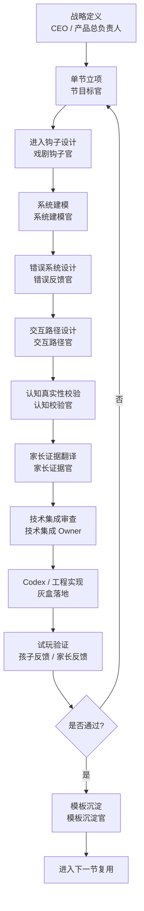

# CEO 流程分工图

版本：v0.1  
定位：把“单节工业化生产”画成团队可以直接照着跑的流程图

## 1. 总图

## 2. 每一阶段到底在解决什么问题

### 阶段 1：战略定义

目标：

- 定义北极星
- 决定阶段优先级
- 明确当前只做什么，不做什么

核心问题：

- 这家公司现阶段最重要的产出是什么
- 我们现在是在验证世界、验证单节、还是验证增长

输出物：

- 北极星定义
- 阶段目标
- 版本边界

不通过的典型信号：

- 团队对“当前要赢什么”各说各话

### 阶段 2：单节立项

目标：

- 把一个模糊想法压缩成一个明确的单节目标

核心问题：

- 这节练哪 1-2 个主轴
- 孩子离开时带走什么方法
- 家长最终看见什么证据
- 本节明确不做什么

输出物：

- 节目标卡

不通过的典型信号：

- 一节里想练所有能力
- 只有世界推进，没有认知目标

### 阶段 3：进入钩子设计

目标：

- 让孩子在 2 分钟内愿意继续往下走

核心问题：

- 第一眼异常是什么
- 谁先说话
- 第一波误导信息是什么
- 为什么孩子会想介入

输出物：

- 进入钩子卡

不通过的典型信号：

- 开场过于解释
- 异常不明显
- 课程感太重

### 阶段 4：系统建模

目标：

- 把故事压成一个可运行的系统

核心问题：

- 系统对象是什么
- 模块、状态、输入输出、依赖分别是什么
- 搅局点到底改了什么

输出物：

- 系统结构卡

不通过的典型信号：

- 有剧情，没有系统
- 有系统名词，没有状态层

### 阶段 5：错误系统设计

目标：

- 把失败变成调试入口，而不是失败结算

核心问题：

- 暴露哪些错误
- 错误如何被看见
- 如何帮助孩子缩小范围
- 哪些错误是第一次运行后保留下来的

输出物：

- 错误设计卡

不通过的典型信号：

- 统一失败提示
- 错误直接给答案
- 没有二次修复价值

### 阶段 6：交互路径设计

目标：

- 让孩子真实经历“看 -> 判 -> 改 -> 跑 -> 修”

核心问题：

- 孩子先看什么
- 先判断什么
- 可以操作什么
- 什么时候运行
- 什么时候重跑

输出物：

- 交互流程卡

不通过的典型信号：

- 只是一路点击下一步
- 操作多，但判断少

### 阶段 7：认知真实性校验

目标：

- 防止这节看起来像编程思维，实际上只是剧情解谜

核心问题：

- 主打主轴是否真的发生
- 判断和调试是否真实发生
- 认知负担是否匹配年龄带
- 结束时有没有认知抬升

输出物：

- 主轴校验卡

不通过的典型信号：

- 拿掉剧情皮后，思维动作不存在

### 阶段 8：家长证据翻译

目标：

- 把孩子端行为翻译成家长能信的价值

核心问题：

- 这节最值得让家长看到的三条证据是什么
- 怎样表达才不鸡汤、不空泛

输出物：

- 家长证据卡

不通过的典型信号：

- 只有“完成了”“用时多久”“表现不错”

### 阶段 9：技术集成审查

目标：

- 防止本节实现破坏长期统一骨架

核心问题：

- 哪些复用旧组件
- 哪些需要新建
- 哪些可以临时 hardcode
- 哪些会破坏状态、错误和配置统一性

输出物：

- 技术审查结论
- Codex 输入包
- 技术红线

不通过的典型信号：

- 每节重新造状态系统
- 错误类型命名漂移

### 阶段 10：Codex / 工程实现

目标：

- 先把灰盒跑通，再补包装

核心问题：

- 状态能不能跑
- 规则能不能改
- 报错能不能出
- 重跑能不能成立

输出物：

- 灰盒页面
- 状态流说明
- 错误流说明
- 分歧回报

不通过的典型信号：

- 页面很多，闭环不成立

### 阶段 11：试玩验证

目标：

- 验证孩子端真实行为和家长端真实感知

核心问题：

- 孩子有没有真实判断
- 报错有没有帮助缩小范围
- 家长能不能一句话说明这节练了什么

输出物：

- 试玩记录
- 观察问题单
- 修订建议

### 阶段 12：模板沉淀

目标：

- 让这节做完后留下生产资产

核心问题：

- 哪些结构可复用
- 哪些错误模板可复用
- 哪些坑以后不能再踩

输出物：

- 模板归档卡
- 模板库更新项
- 下一节优化建议

## 3. 关键闸门

整个流程中有四个必须明确通过的闸门。

### 闸门 A：立项闸门

必须满足：

- 主打主轴清楚
- 单节目标清楚
- 不做项清楚

### 闸门 B：可执行闸门

必须满足：

- 系统结构卡完成
- 错误设计卡完成
- 交互流程卡完成
- 成功标准卡完成

### 闸门 C：技术闸门

必须满足：

- 不破坏统一状态结构
- 不破坏统一错误结构
- 不破坏统一运行与重跑机制

### 闸门 D：验收闸门

必须满足：

- 孩子发生至少一次真实判断
- 孩子完成至少一次修改和一次重跑
- 至少暴露两类可观测错误
- 家长证据可清楚复述

## 4. CEO 每周只抓什么

CEO 不该陷入所有细节，而应盯住每周的四个信号：

1. 本周是否有单节闭环真正跑通
2. 本周返工主要卡在哪个闸门
3. 第二节是否比第一节更容易做
4. 模板库是否真的在增长

如果这四个信号持续变好，公司就在形成生产能力。

## 5. 最终理解

流程图的作用不是把事情画复杂，而是让团队知道：

- 从哪里开始
- 经过哪些闸门
- 哪一步谁负责
- 哪一步没过不能往下硬推

一句话总结：

先把单节生产流程图画清楚，公司才有资格谈规模化。
